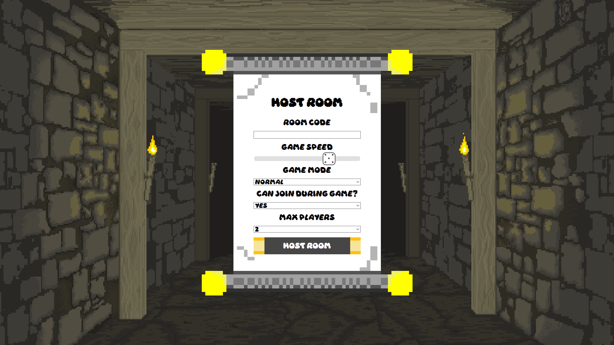
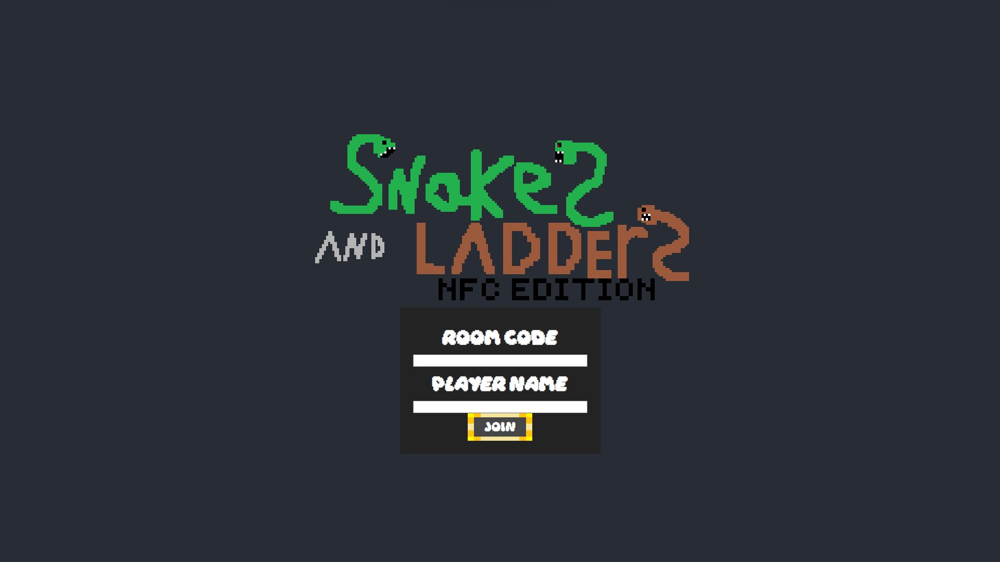

# Snakes And Ladders NFC Edition
#### Snakes and Ladders game made in React using Socket.io

## Table of contents

1. [Install](#install)
2. [Packages](#packages)
    1. [Frontend](#frontend-packages)
    2. [Backend](#backend-packages)

## Install
### You need to **Install** all the packages the react app is using and the server
#### Use this command on the **Terminal**, run this for both the server folder (Backend) and the React folder (Frontend)
```
npm install --force
```

### Build the react project
```
npm run build
```

### Running the Server
#### if you have nodemon installed you can skip this and configure yourself
```
node index.js
```

## Packages

### Frontend Packages

| Package    | Link | Version |
| -------- | ------- | ------- |
| ReactJS  | [https://react.dev](https://react.dev)    | 18.2.0 |
| SocketIO (Client) | [https://github.com/socketio/socket.io-client](https://github.com/socketio/socket.io-client)     | 4.7.4 |
| React Confetti Explosion | https://github.com/herrethan/react-confetti-explosion | 2.1.2 |
| react-sound    | [https://github.com/leoasis/react-sound](https://github.com/leoasis/react-sound)    | 1.2.0 | 

### Backend Packages

| Package    | Link | Version |
| -------- | ------- | ------- |
| SocketIO  | [https://socket.io/docs/v4/](https://socket.io/docs/v4/)    | 4.7.4 |
| Express | [https://expressjs.com](https://expressjs.com) | 4.18.2 |

# Developing

## Server

### Room Hosting

#### Board.js in /host will emit a event called **host** when you host a room with the given options

Hosting a room is created by **GameRooms[data.RoomCode]** adds a new object inside the array that can be only be called with the room code, The socket will join the room code allowing clients connected to the room recive data from the host.

Snakes and Ladders object are used to define the placement of snake and ladder tiles when a game board array is created using the function **setupGameBoard(snakes, ladders)**, you are able to costumize the placements by changing the key and value with no limit

#### The frontend (Host) will send a list of data to the  **GameRooms**, that each is used to add values for settings
| Settings | Information | Type |
| -------- | ------- | ------- |
| gameboard  | contains the array of the board the game will use for its logic and frontend | array |
| gamePlayers | contains a array made with the **Players** class that contains list of players currently in game and functions used to add or remove players| players class |
| gameMode | game mode used to define what mode we are currently playing, this is not properly implemented. | string |
| playerTurn | used to know what turn it is based on the player number inside the player object | number |
| canJoin | enables or disables players can join while the game is currently running | boolean |
| gameStarted | let the game know the game has started | boolean |
| turnChanged| only used inside **changeTurn** function to check if the turn has already changed or not | boolean |
| playerIsMoving | used to check is player is moving on the game board or not, this prevents clients to roll the dice when another player is moving | boolean |
| maxPlayers | maximum amounts of players in the game | number |
| Winner | name of the player who won | string |
| gameSpeed | amount of milliseconds to play the animation when a player is moving each tile | number |

```js
socket.on("host", async (data) => {

    const snakes = {
        14: 4,
        16: 6,
        28: 10,
        43: 20,
        51: 31,
        62: 39,
        77: 26,
        90: 70,
        99: 78
    };

    const ladders = {
        2: 19,
        8: 27,
        16: 37,
        24: 54,
        34: 48,
        41: 60,
        65: 84,
        73: 94,
    };

    gameRooms[data.RoomCode] = {
        gameboard: setupGameBoard(snakes, ladders),
        gamePlayers: new Players,
        gameMode: data.mode,
        playerTurn: 0,
        canJoin: true,
        gameStarted: false,
        turnChanged: false,
        playerisMoving: false,
        maxPlayers: data.max,
        Winner: "",
        gameSpeed: data.speed,
    }

    socket.join(data.RoomCode)
})
```
### Player Class
#### Each player in players array contains these values

| Key | Information | Type |
| ----- | ----- | ----- |
| Name | Name of the player | string
| Position | Tile position of what player is currently in | number
| PlayerNumber | Number of the player | number
| Turn | If its the player's turn (only used in the frontend) | boolean

```js
class Player {
    constructor(Name, position, playernumber) {
        this.Name = Name;
        this.Position = position;
        this.PlayerNumber = playernumber;
        this.Turn = false
    }
}
class Players {

    constructor() {
        this.players = []
    }

    newPlayer(name, position, number) {
        let p = new Player(name, position, number)

        if (this.numberOfPlayers() === 0) {
            p.Turn = true
        }

        this.players.push(p)
        return p
    }
    allPlayers() {
        return this.players
    }

    numberOfPlayers() {
        return this.players.length
    }

    removePlayer(name) {
        for (let player of this.allPlayers()) {
            if (player.Name == name) {
                this.players.splice(player.PlayerNumber, 1);
            }
        }
    }

    getPlayer(name) {
        for (let player of this.allPlayers()) {
            if (player.Name == name) {
                return player
            }
        }
    }

    getPlayerByTurn(number) {
        for (let player of this.allPlayers()) {
            if (player.PlayerNumber == number) {
                return player
            }
        }
    }

}
```

### Player Joining
This is where the Players class comes to use, adds a new player to the players array inside the **GameRoom** variable and joins the room with the code

Before a player gets added to the array and joins the room it has to go trough list of if statements to check if can join or not, this will prevent crashing the server by adding wrong data.

```js
socket.on("PlayerJoin", async (data) => {

let roomCode = data.RoomCode

if (!gameRooms[roomCode]) {
    socket.emit("clientMessage", "Room dosen't exist")
        return;
    }

    else if (gameRooms[roomCode].canJoin == false) {
        socket.emit("clientMessage", "You cannot join this room")
        return
    }

    else if (gameRooms[roomCode].maxPlayers < (gameRooms[roomCode].gamePlayers.numberOfPlayers() + 1 || gameRooms[roomCode].canJoin)) {
        socket.emit("clientMessage", "Too many Players")
        return
    }

    for (i = 0; i < gameRooms[roomCode].gamePlayers.allPlayers().length; i++) {
        if (gameRooms[roomCode].gamePlayers.allPlayers()[i].Name === data.Player) {
            socket.emit("clientMessage", "Player already has that name")
            return
        }
    }

    socket.join(data.RoomCode)

    if (gameRooms[roomCode].gameStarted) {
        socket.emit("clientStart")
    }

    let playernumber = gameRooms[roomCode].gamePlayers.numberOfPlayers()

    gameRooms[roomCode].gamePlayers.newPlayer(data.Player, 1, playernumber);

    if (gameRooms[roomCode].gameStarted == true) {
        gameRooms[roomCode].gameboard[0][0].playerinTile.push(gameRooms[roomCode].gamePlayers.getPlayer(data.Player))
        io.to(data.RoomCode).emit("renderBoard", gameRooms[roomCode].gameboard)
    }

    io.to(data.RoomCode).emit("updatePlayers", gameRooms[roomCode].gamePlayers.allPlayers())
})
```


### Game Logic 
Most of the game logic is handled in the server with **playerRoll** socket event, which is called every time a player rolls the dice
The function called **renderLoop** inside the event contains most of the game's logic, uses setTimeout to wait each time a function is calling, it will be called based on what number of the dice.
The gameboard array is changed and sends it to the host each time in the loop
```js
function renderLoop(i, isSnake) {
    if (i <= diceRoll) {


        let player = gameRooms[roomCode].gamePlayers.getPlayer(playerName)
        let currentPosition = isSnake ? player.Position : (player.Position + i)

        for (let l = 0; l < BOARD_SIZE; l++) {
            for (let j = 0; j < BOARD_SIZE; j++) {

                if (gameBoard[l][j].playerinTile.length > 0) {

                    gameBoard[l][j].playerinTile = gameBoard[l][j].playerinTile.filter(p => p.Name !== playerName);

                }
                if (gameBoard[l][j].tile === currentPosition) {
                    newPosition = gameBoard[l][j]


                    gameBoard[l][j].playerinTile.push(gameRooms[roomCode].gamePlayers.getPlayer(playerName));

                    io.to(data.RoomCode).emit("renderBoard", gameBoard)
                } else if ((player.Position + diceRoll) > 100) {

                    io.to(data.RoomCode).emit("message", { message: (diceRoll + " is higher than 100"), data: { player: gameRooms[roomCode].gamePlayers.getPlayer(playerName), dice: diceRoll } })

                    gameRooms[roomCode].playerisMoving = false
                    break;
                }
            }
        }

        setTimeout(() => {

            renderLoop(i + 1, false);

        }, delay);
    } else {
        if (isSnake) {
            return;
        }

        if ((gameRooms[roomCode].gamePlayers.getPlayer(playerName).Position + diceRoll) > 100) {

            changeTurn(roomCode)

            io.to(data.RoomCode).emit("message", { message: (gameRooms[roomCode].gamePlayers.getPlayer(gameRooms[roomCode].playerTurn).Name + "'s turn"), data: { player: gameRooms[roomCode].gamePlayers.getPlayer(playerName), dice: diceRoll } })
            io.to(data.RoomCode).emit("updatePlayers", gameRooms[roomCode].gamePlayers.allPlayers())
            return
        }

        gameRooms[roomCode].gamePlayers.getPlayer(playerName).Position = newPosition.position

        if ((gameRooms[roomCode].gamePlayers.getPlayer(playerName).Position) === 100) {
            gameRooms[roomCode].gameStarted = false
            gameRooms[roomCode].Winner = gameRooms[roomCode].gamePlayers.getPlayer(playerName).Name
            io.to(data.RoomCode).emit("message", { message: (gameRooms[roomCode].Winner + " Won the game🔥"), data: { player: gameRooms[roomCode].gamePlayers.getPlayer(playerName), dice: diceRoll } })

            io.to(data.RoomCode).emit("playerWin", gameRooms[roomCode].Winner)
            return
        }

        if (newPosition.type == "ladder" || newPosition.type == "snake") {
            renderLoop(diceRoll, true)
        } else {
            changeTurn(roomCode)

            io.to(data.RoomCode).emit("renderBoard", gameBoard)

            gameRooms[roomCode].playerisMoving = false

            io.to(data.RoomCode).emit("updatePlayers", gameRooms[roomCode].gamePlayers.allPlayers())
        }


    }

}
```

### Messages to the clients
A message that all the clients will get in the frontend is built with a object

{message: **Contains the message**, {player: **Player** (used to know what player rolled the dice), dice: **Dice number**}}

```js
io.to(data.RoomCode).emit("message", { message: (playerName + " Rolled " + diceRoll), data: { player: gameRooms[roomCode].gamePlayers.getPlayer(playerName), dice: diceRoll } })
```

## Frontend

### Board.js
#### Hosts the game and renders the board



#### Events on useEffect
```js
socket.on("connect", onJoin)
socket.on("playerWin", (winner) => handleWinner(winner))
socket.on("updatePlayers", (player) => setPlayers(player))
socket.on("renderBoard", (map) => {
    setGameBoard(map);
})
socket.on("message", (messagedata) => {
    setGameStateMessage(messagedata.message)

    changeDiceDisplay(messagedata.data.dice)
})
```

### Player.js
#### The player that joins the room with code and allows to roll the dice




#### Events on useEffect
```js
socket.on("connect", onJoin)
socket.on("disconnect", onLeave)
socket.on("message", (data) => {
    if (data.data.name === PlayerName) {
        setGameStateMessage("Your turn")
    } else {
        setGameStateMessage(data.message)
    }

    changeDiceDisplay(data.data.dice)
    setCurrentPlayer(data.data.player)
})
socket.on("clientStart", () => setclientGameRunning(true))
socket.on("clientMessage", (clientmessage) => handleClientMessage(clientmessage))
socket.on("hostisgone", () => window.location.reload())
```

#### Socket emits the player emits to the server
```js
const handleJoinButtonClick = () => {

    setShowJoinRoomUI(false);
    setWaitForHost(true)
    setError(false)

    socket.emit("PlayerJoin", { Player: PlayerName, RoomCode: roomCode });
};

const handleLeave = () => {
    socket.emit("LeaveGame", { Player: PlayerName, RoomCode: roomCode })
    window.location.reload()
}

const rollDice = () => {
    socket.emit("playerRoll", { Player: PlayerName, RoomCode: roomCode });
}
```
